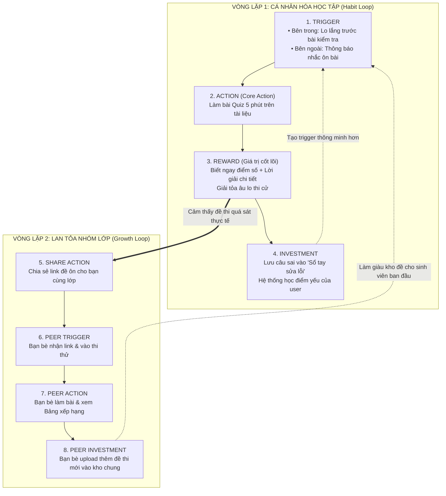

# BÁO CÁO BÀI LAB DAY 20: PRODUCT METRICS & RETENTION FRAMEWORK

> **Khóa học / Track**: Track 1 - AI Product Management / Product Metrics  
> **Họ và tên học viên**: Nguyễn Thị Minh Khánh  
> **Mã học viên**: 2A202602546  
> **Dự án lựa chọn**: **StudyMate AI - Trợ lý AI Tóm tắt & Luyện đề Ôn thi Thông minh cho Sinh viên**  
> **Thời gian thực hiện**: 90 phút  

---

## MỤC LỤC BÀI LÀM
1. [Phase 0: Chốt phạm vi bài làm (Scope & Context)](#phase-0-chốt-phạm-vi-bài-làm-scope--context)
2. [Phase 1: Xác định Core Action (Core Action Card)](#phase-1-xác-định-core-action-core-action-card)
3. [Phase 2: Nature & Natural Cadence Card](#phase-2-nature--natural-cadence-card)
4. [Phase 3: Hệ thống Metric & Định nghĩa Retention (Metric System & Retention Definition)](#phase-3-hệ-thống-metric--định-nghĩa-retention)
5. [Phase 4: Thiết kế Product Loop & Minimum Tracking Spec](#phase-4-thiết-kế-product-loop--minimum-tracking-spec)
6. [Phase 5: Bảng tự soi lỗi (Self-Audit) & AI Support Log](#phase-5-bảng-tự-soi-lỗi-self-audit--ai-support-log)

---

## PHASE 0: CHỐT PHẠM VI BÀI LÀM (SCOPE & CONTEXT)

| Thành phần | Chi tiết định nghĩa |
| :--- | :--- |
| **Tên sản phẩm** | **StudyMate AI** (AI Personal Assistant for Students) |
| **Mô tả ngắn gọn (1 câu)** | Nền tảng trợ lý học tập AI giúp sinh viên biến giáo trình, slide bài giảng phức tạp thành bộ câu hỏi trắc nghiệm & flashcard ôn thi bám sát đề cương chỉ trong 30 giây. |
| **Target Persona** | **Sinh viên Đại học (Năm 1 – Năm 4)** các khối ngành có khối lượng tài liệu học tập và thi cử lớn (Kinh tế, Kỹ thuật, Y Dược, Luật), thường xuyên bị quá tải trước các kỳ thi giữa kỳ / cuối kỳ. |
| **Core Job to be Done (JTBD)** | *"Khi tôi có tập tài liệu/slide 60 trang và kỳ thi sắp diễn ra, tôi muốn nhanh chóng nắm được trọng tâm kiến thức và tự kiểm tra mức độ hiểu bài của mình để tự tin đạt điểm cao mà không phải thức trắng đêm đọc vẹt."* |
| **Use Case chính được chọn** | **Tải lên tài liệu slide bài học $\rightarrow$ AI trích xuất trọng tâm & tạo bộ đề trắc nghiệm $\rightarrow$ Sinh viên thực hiện phiên luyện đề ôn tập (Quiz Session) và nhận giải thích chi tiết.** |

---

## PHASE 1: CORE ACTION (15 PHÚT)

### 1. Phân biệt bốn khái niệm (5 phút)

| Khái niệm | Câu hỏi trọng tâm | Áp dụng vào StudyMate AI |
| :--- | :--- | :--- |
| **Core Job** | User đang cố hoàn thành việc gì? | Nắm vững trọng tâm tài liệu học tập và tự tin vượt qua bài kiểm tra/kỳ thi sắp tới. |
| **Core Action** | User làm gì trong sản phẩm để tiến tới giá trị? | Trả lời và nộp bài luyện đề trắc nghiệm/flashcard từ tài liệu học tập. |
| **Core Value** | User nhận được lợi ích gì? | Biết chính xác lỗ hổng kiến thức, hiểu cách giải đúng và an tâm nắm vững bài học. |
| **Core Value Event** | Sự kiện nào chứng minh value đã xảy ra? | `quiz_completed` với `score >= 70%` (hoặc hoàn tất xem giải thích câu sai). |

> **Ghi chú phân biệt**: `AI tạo đề thi` chỉ là **System Output**, `Bấm bắt đầu` là **Thao tác UI**, chỉ khi người dùng hoàn thành và nộp bài kiểm tra thì mới là **Core Action** xác nhận đã thu nhận giá trị.

---

### 2. Điền Core Action Card (10 phút)

| Thành phần | Câu trả lời chi tiết cho StudyMate AI |
| :--- | :--- |
| **Target user** | Sinh viên Đại học (Năm 1 – 4) cần ôn tập kiến thức môn học trước buổi lên lớp hoặc trước kỳ thi. |
| **Core job** | Nắm bắt trọng tâm tài liệu ôn thi và kiểm tra mức độ hiểu bài thực tế trong thời gian ngắn. |
| **Core action** | Hoàn thành và nộp bài phiên luyện đề trắc nghiệm/flashcard ôn thi (Qualified Quiz Session). |
| **Object** | Bộ câu hỏi kiểm tra kiến thức được AI trích xuất và tạo từ tài liệu học tập (Slide, PDF, Giáo trình). |
| **Preconditions** | Tài liệu học tập đã được tải lên và AI đã xử lý tạo bộ đề thi thành công. |
| **Completion rule** | Người dùng trả lời đủ 100% số câu hỏi trong phiên (tối thiểu 5 câu) và bấm nút **"Nộp bài & Xem kết quả"**. |
| **Core value** | Kiểm chứng ngay lập tức mức độ nắm bài, giải tỏa lo lắng thi cử và biết rõ điểm yếu cần bổ sung. |
| **Evidence of value** | Điểm số bài làm đạt $\ge 70\%$ HOẶC người dùng hoàn thành xem 100% giải thích chi tiết các câu trả lời sai. |
| **Candidate event** | `quiz_completed` (với các thuộc tính: `user_id`, `quiz_id`, `score_percent`, `is_qualified: true/false`). |

---

### 3. Tự kiểm 5 tiêu chí (Self-Audit 5 Criteria)

| Tiêu chí tự kiểm | Câu hỏi đánh giá | Kết quả chấm | Minh chứng & Lập luận |
| :---: | :--- | :---: | :--- |
| **1. Gần core value** | Hành vi xảy ra là user đã tiến gần rõ rệt tới value chưa? | **ĐẠT (Pass)** | Khi nộp bài và xem bảng điểm/lời giải, sinh viên đã hoàn thành chu trình ôn luyện và kiểm tra kiến thức. |
| **2. Có thể lặp lại** | Hành vi có xuất hiện lại khi nhu cầu quay lại không? | **ĐẠT (Pass)** | Có. Mỗi khi có bài học mới trong tuần hoặc bước vào đợt thi mới, sinh viên lại tiếp tục mở đề luyện tập. |
| **3. Có thể quan sát** | Bạn biết chính xác khi nào nó hoàn tất không? | **ĐẠT (Pass)** | Biết chính xác 100% tại thời điểm sinh viên gửi request nộp bài (`quiz_completed`) lên server. |
| **4. Có ý nghĩa** | Hành vi tăng có thật sự nghĩa là sản phẩm tốt hơn không? | **ĐẠT (Pass)** | Có. Số lượt hoàn thành bài quiz tăng đồng nghĩa với việc sinh viên thực sự học và ôn tập nhiều hơn qua app. |
| **5. Có thể tác động** | Team có thể cải thiện khả năng nó xảy ra không? | **ĐẠT (Pass)** | Có. Team có thể tối ưu thuật toán tạo câu hỏi sát đề cương hơn, giảm độ dài quiz xuống 5 phút, thêm giải thích trực quan. |

---

### 4. Giải thích vì sao không phải "Mở app", "Đăng nhập" hay "Hỏi AI"

* **Vì sao không chọn "Mở app" / "Đăng nhập"?**  
  Đây thuần túy là **thao tác giao diện (UI interaction / Session start)**. Người dùng mở app rồi tắt ngay hoặc chỉ đăng nhập để đó hoàn toàn chưa nhận được bất kỳ giá trị học tập nào.
* **Vì sao không chọn "Hỏi AI" hay "AI tạo đề thi thành công"?**  
  - "Hỏi AI" là hành vi đầu vào (Input/Prompt) rất mơ hồ, chưa đo lường được kết quả.
  - "AI tạo đề thi" là **System Output** (hệ thống hoàn thành xử lý), chưa chứng minh được sinh viên đã đọc, đã học và đã hiểu kiến thức đó.

---

### 5. GATE 1 — CORE ACTION ĐỨNG VỮNG
- [x] **Đủ cấu trúc**: Có Actor (*Sinh viên*), Object (*Bộ đề từ tài liệu*), Completion Rule (*Nộp bài & nhận kết quả*).
- [x] **Vượt qua 5/5 tiêu chí tự kiểm**: Đạt tuyệt đối 5/5 tiêu chí (Gần core value, Lặp lại, Quan sát, Có ý nghĩa, Tác động được).
- [x] **Phân biệt rạch ròi**: Giải thích rõ ràng vì sao loại bỏ UI click và System Output để chọn hành vi tạo giá trị thực.
- **KẾT LUẬN: ĐỦ ĐIỀU KIỆN QUA GATE 1 ĐỂ SANG PHASE 2.**

---

## PHASE 2: NATURE & CADENCE (15 PHÚT)

### 1. Điền Action Nature Card (10 phút)

| Thành phần | Câu hỏi định hướng | Phân tích chi tiết cho StudyMate AI |
| :--- | :--- | :--- |
| **Actor** | User, account, team hay object nào thực hiện? | **User (Sinh viên đại học)** trực tiếp thực hiện trên tài khoản cá nhân. |
| **Intent** | Hành vi bắt đầu từ nhu cầu gì? | Nhu cầu chuẩn bị bài trước giờ lên lớp, củng cố kiến thức sau buổi giảng hoặc ôn thi nước rút để đạt điểm cao. |
| **Trigger** | Do user chủ động, sự kiện bên ngoài, người khác hay hệ thống kích hoạt? | **Kết hợp cả 3:** • *Bên trong (Chủ động):* Tâm lý lo lắng trước bài kiểm tra, mong muốn đạt GPA cao. • *Sự kiện bên ngoài:* Lịch học trên trường, hạn nộp bài tập, lịch thi giữa kỳ/cuối kỳ. • *Hệ thống:* Thông báo nhắc lịch ôn bài trước giờ lên lớp 24h. |
| **Effort** | Mất bao nhiêu thời gian, suy nghĩ, dữ liệu? | • *Thời gian:* 5 – 10 phút cho một phiên làm bài 5–10 câu hỏi. • *Nhận thức (Cognitive effort):* Mức trung bình – cao (đòi hỏi đọc đề, tư duy logic và lựa chọn đáp án). • *Dữ liệu:* Cần có sẵn ít nhất 1 tài liệu/slide bài giảng. |
| **Value timing** | Value xuất hiện ngay, trễ, tích lũy, hay phụ thuộc người khác? | • **Ngay lập tức:** Nhận điểm số và giải thích chi tiết câu đúng/sai sau khi nộp bài. • **Tích lũy:** Sự tự tin và điểm số thi cử thật trên giảng đường sau nhiều tuần ôn luyện. |
| **State** | Sau action, dữ liệu/trạng thái nào được giữ lại? | • Điểm số phiên làm bài được ghi nhận vào lịch sử học tập. • Các câu trả lời sai tự động được thêm vào **"Sổ tay lỗi sai (Error Notebook)"** để tạo đề ôn lại sau này. |
| **Dependency** | Có phụ thuộc nguồn cung, thành viên khác, approval, thời điểm? | Phụ thuộc vào **thời điểm trong kỳ học** (kỳ học bắt đầu, đợt thi giữa kỳ/cuối kỳ) và **tài liệu học tập** của giảng viên phát. Không phụ thuộc vào sự phê duyệt của người khác. |
| **Repeat condition** | Điều kiện nào khiến action có lý do xuất hiện lại? | • Sinh viên có bài học/chương mới trên lớp vào tuần tiếp theo. • Bước vào đợt ôn thi môn học tiếp theo. • Có nhu cầu làm lại các câu từng làm sai trong Sổ tay lỗi sai. |

---

### 2. Kết luận Cadence (5 phút)

#### a) Lựa chọn dạng hành vi
* **Dạng hành vi:** **Theo chu kỳ học tập & Tiến trình tích lũy (Cyclical & Cumulative Progress)**.
  - Hành vi không xuất hiện ngẫu nhiên mà vận động theo chu kỳ tuần học (2-3 buổi học/môn/tuần) và theo chu kỳ mùa thi (Mid-term / Final-term).

#### b) Kết luận chuẩn hóa theo Template
> **Kết luận Cadence:**  
> *"Đối với **sinh viên đại học**, core action **hoàn thành phiên luyện đề ôn tập môn học đạt điểm $\ge 70\%$** thường xuất hiện **1 – 3 lần mỗi tuần (và tăng lên 4 – 6 lần/tuần trong đợt thi)** vì **lịch học tín chỉ diễn ra theo tuần (2–3 buổi/môn/tuần) và các bài kiểm tra được xếp lịch định kỳ**. Do đó, nhịp đo phù hợp là **WEEKLY (Hàng tuần - Chu kỳ 7 ngày)** ở cấp **User Account**."*

---

### 3. Cân nhắc chuyên sâu: Frequency cao hơn có luôn đồng nghĩa Value cao hơn?

* **Với sản phẩm AI như StudyMate AI:**  
  - Sinh viên vào app, làm nhanh một bài test 5 phút nắm vững 100% bài học và quay lại học môn khác mang lại **nhiều giá trị hơn** việc sinh viên phải ngồi mày mò 2 tiếng trong app vì AI tạo câu hỏi lan man.
  - Do đó, chúng ta **không tối ưu chỉ số ảo (Vanity Metric) như Time Spent on App hay Daily Grind**, mà tối ưu **chất lượng của mỗi phiên luyện đề (Completion Rate & Score $\ge 70\%$)** theo đúng nhịp tự nhiên hàng tuần.

---

### 4. GATE 2 — CADENCE TỪ NATURE, KHÔNG TỪ DASHBOARD (PASS GATE 2)
- [x] **Đúng template kết luận**: Có đầy đủ Persona, Core Action, Tần suất, Lý do "vì", Nhịp đo và Cấp độ đối tượng.
- [x] **Lập luận "vì" vững chắc**: Xuất phát từ thực tế thời khóa biểu đại học và lịch thi cử (Nature), không lấy từ thói quen dashboard.
- [x] **Không mâu thuẫn**: Nhịp đo **Weekly** hoàn toàn tương thích với dạng hành vi **Theo chu kỳ & Tích lũy**.
- **KẾT LUẬN: ĐỦ ĐIỀU KIỆN QUA GATE 2 ĐỂ SANG PHASE 3.**

---

## PHASE 3: HỆ THỐNG METRIC & ĐỊNH NGHĨA RETENTION

## PHASE 3: METRIC SYSTEM + RETENTION (25 PHÚT)

### 1. Activation Metric (5 phút)

| Thành phần cấu thành | Định nghĩa cho StudyMate AI |
| :--- | :--- |
| **Start event** | `user_signed_up`: Thời điểm sinh viên hoàn tất tạo tài khoản thành công. |
| **Activation event** | `first_quiz_completed` với `score >= 70%`: Thời điểm sinh viên lần đầu tiên hoàn thành và nộp 1 bài luyện đề đạt điểm chuẩn (chạm tới "Aha Moment" & nhận first value). |
| **Time window** | Trong vòng **48 giờ** kể từ thời điểm `user_signed_up`. |

* **Tên chỉ số:** **48-Hour First Qualified Quiz Completion Rate**
* **Công thức tính:**
  $$\text{Activation Rate} = \frac{\text{Số user mới hoàn thành 1st Quiz } \ge 70\% \text{ trong 48h}}{\text{Tổng số user mới đăng ký trong cùng kỳ}} \times 100\%$$
* **Tránh lỗi kinh điển:** Tuyệt đối không dùng "Hoàn tất tour giới thiệu (Onboarding completed)" hay "Đăng nhập lại lần 2" làm Activation vì user chưa hề tiếp thu kiến thức hay nhận giá trị học tập cốt lõi.

---

### 2. Engagement Metric (3 phút)

Chọn 2 góc đo chuyên sâu khớp với Natural Cadence:

1. **Góc đo Frequency (Tần suất ôn luyện theo tuần):**
   * **Tên chỉ số:** **Weekly Quiz Frequency per Active User**
   * **Công thức:** $\frac{\text{Tổng số Qualified Quizzes hoàn thành trong tuần}}{\text{Số lượng Weekly Active Users (WAU)}}$
   * **Ý nghĩa:** Đo lường mức độ hình thành thói quen ôn bài đều đặn của sinh viên (Mục tiêu: $\ge 2.5$ phiên/tuần).

2. **Góc đo Depth (Độ sâu giá trị thu nhận):**
   * **Tên chỉ số:** **Error Notebook Review Rate (Tỉ lệ rà soát câu sai)**
   * **Công thức:** $\frac{\text{Số user xem giải thích chi tiết và lưu câu sai vào sổ tay}}{\text{Tổng số user có câu trả lời sai trong phiên}} \times 100\%$
   * **Ý nghĩa:** Đo lường mức độ học tập chủ động và đào sâu kiến thức thay vì chỉ làm bài chống đối.

---

### 3. Retention Definition (Đầy đủ 6 thành phần) (7 phút)

#### a) Hợp đồng định nghĩa Retention (Retention Definition Contract)

| Thành phần | Câu hỏi định hướng | Định nghĩa chi tiết cho StudyMate AI |
| :--- | :--- | :--- |
| **1. Unit** | User, account, team hay object? | **User Account** duy nhất (distinct `user_id` của sinh viên). |
| **2. Cohort entry** | Event nào đưa unit vào cohort? | Hoàn thành hành vi Activation (`first_quiz_completed` với `score >= 70%` trong vòng 48h). |
| **3. Return event** | Core action nào phải lặp lại? | **Bắt buộc là Core Action:** Thực hiện `quiz_completed` với `score >= 70%` (hoàn tất xem giải thích câu sai). *Tuyệt đối KHÔNG dùng app_opened hay login*. |
| **4. Window** | Khung thời gian đo là gì? | **Weekly Rolling Windows (W1, W2, W3, W4, W8, W12)** – Mỗi window là một chu kỳ 7 ngày liên tiếp (khớp 100% với Cadence ở Phase 2). |
| **5. Threshold** | Tần suất bao nhiêu trong window? | Tối thiểu $\ge 1$ lần hoàn thành Qualified Quiz trong window 7 ngày đó. |
| **6. Segment** | Áp dụng phân tích cho ai? | • Khối ngành: STEM / Y Dược vs. Kinh tế / Xã hội. • Gói sử dụng: Free vs. Pro Subscriber. • Kênh tiếp cận: Tự tìm kiếm (Organic) vs. Được mời qua Shared Quiz Link. |

#### b) Đối chiếu Retention với 3 mốc (S34 Framework)
1. **Mốc 1 - Natural cycle (Chu kỳ tự nhiên):** Đo theo Weekly Cohort (W1..W12) khớp đúng với thời lượng 1 học kỳ đại học (12 - 15 tuần).
2. **Mốc 2 - Cohort đúng segment:** Segment học sinh được mời qua **Shared Quiz Link** kỳ vọng giữ chân cao hơn 25–30% so với segment tự học đơn lẻ.
3. **Mốc 3 - Benchmark category (EdTech & Study Tools):** W4 Retention tiêu chuẩn ngành EdTech là 25% – 35%; StudyMate AI đặt mục tiêu W4 Retention đạt **35%**.

---

### 4. North Star Metric + Leading Indicators + Counter-Metrics (10 phút)

#### a) North Star Metric (NSM) chuẩn 3 thành phần
* **Công thức cấu thành:**
  $$\text{NSM} = \text{Unit of Value (Qualified Quiz Session)} + \text{Quality Threshold (Score } \ge 70\%) + \text{Frequency (Weekly)}$$
* **Tên chỉ số:** **Weekly Qualified Quiz Completions (WQQC)**
* **Định nghĩa:** Tổng số phiên luyện đề trắc nghiệm/flashcard được sinh viên hoàn thành với điểm số $\ge 70\%$ (hoặc xem 100% giải thích) trong mỗi chu kỳ 7 ngày.
* **Lý do chọn:** Phản ánh trực tiếp khối lượng kiến thức thực tế mà sinh viên ôn luyện thành công qua app; không bị ảo như chỉ số "số lượt hỏi AI" hay "doanh thu".

#### b) Leading Indicators (Chỉ số dẫn dắt - Tối đa 3 chỉ số)

1. **D0 Document Upload Rate:**  
   * *Định nghĩa:* % người dùng mới tải lên ít nhất 1 tài liệu/slide môn học trong vòng 2 giờ đầu sau khi tạo tài khoản.  
   * *Vì sao dự báo được Core Action:* Có tài liệu là điều kiện tiên quyết để AI tạo đề thi; user tải lên ngay chứng minh nhu cầu ôn thi cấp thiết và xác suất làm bài quiz đầu tiên trong 48h cao gấp 3 lần.
2. **AI Quiz Generation-to-Start Rate:**  
   * *Định nghĩa:* % số bộ đề AI tạo ra được người dùng bấm "Bắt đầu làm bài" trong vòng 10 phút.  
   * *Vì sao dự báo được Core Action:* Đo lường độ liên quan và sức hấp dẫn của đề thi; đề thi bám sát tài liệu sẽ thúc đẩy sinh viên bắt đầu làm bài ngay thay vì rời bỏ.
3. **Collaborative Quiz Share Rate:**  
   * *Định nghĩa:* % sinh viên bấm chia sẻ bộ đề cho bạn bè sau khi hoàn thành bài test.  
   * *Vì sao dự báo được Core Action:* Sinh viên chia sẻ đề cho bạn cùng lớp sẽ tạo áp lực và động lực học nhóm (Peer learning), kéo cả nhóm quay lại so tài và ôn tập trong các tuần tiếp theo.

#### c) Counter-Metrics (Chỉ số bảo vệ chất lượng - Chống gaming)

1. **Quiz Abandonment Rate (Tỉ lệ bỏ dở giữa chừng):**
   * *Định nghĩa:* % phiên làm bài bị thoát ra trước khi trả lời được 50% số câu hỏi.
   * *Mục đích bảo vệ:* Cảnh báo đề thi quá dài, câu hỏi đánh đố quá mức, hoặc giao diện gây ức chế.
2. **AI Error / Hallucination Report Rate (Tỉ lệ báo cáo ảo giác AI):**
   * *Công thức:* $\frac{\text{Số câu hỏi bị bấm 'Báo lỗi kiến thức'}}{\text{Tổng số câu hỏi được AI sinh ra}} \times 100\%$ (Ngưỡng an toàn: $\le 2\%$).
   * *Mục đích bảo vệ:* Ngăn ngừa việc thuật toán AI sinh ra hàng nghìn câu hỏi nhanh nhưng nội dung sai lệch học thuật, làm mất uy tín sản phẩm.

---

### 5. GATE 3 — METRIC TÍNH ĐƯỢC, RETENTION ĐỦ NGHĨA (PASS GATE 3)
- [x] **Activation metric rõ ràng**: Có Start Event (`user_signed_up`), Activation Event (`first_quiz_completed >= 70%`), Time Window (`48h`).
- [x] **Retention đầy đủ 6 thành phần**: Unit, Cohort entry, Return event (`quiz_completed`), Window (`Weekly`), Threshold (`>=1`), Segment.
- [x] **Khớp Cadence**: Retention đo theo Weekly Window hoàn toàn tương thích với nhịp tự nhiên ở Phase 2.
- [x] **NSM đúng công thức 3 thành phần**: Unit of Value + Quality Threshold + Frequency.
- [x] **Có đủ 2 Counter-metrics**: Bảo vệ trải nghiệm làm bài và chống ảo giác AI.
- **KẾT LUẬN: ĐỦ ĐIỀU KIỆN QUA GATE 3 ĐỂ SANG PHASE 4.**

---

## PHASE 4: THIẾT KẾ PRODUCT LOOP & MINIMUM TRACKING SPEC

### 1. Thiết kế Product Loop (2 chu kỳ liên hoàn)

### 2. Metric Hypothesis (Giả thuyết kiểm chứng vòng lặp)

> **Câu giả thuyết (Metric Hypothesis):**  
> *"Nếu chúng ta triển khai tính năng **'Chia sẻ bộ đề thi thử kèm Bảng xếp hạng điểm nhóm' (Collaborative Quiz Loop)**, thì tỷ lệ **W2 Retention** của sinh viên thuộc nhóm học tập sẽ cao hơn nhóm học đơn lẻ ít nhất **30%**, đồng thời chỉ số **North Star Metric (WQQC)** trung bình trên mỗi người dùng sẽ tăng từ **2.2 lên 3.8 lượt/tuần** trong vòng 60 ngày thử nghiệm."*

---

### 3. Bảng yêu cầu Tracking tối thiểu (Minimum Tracking Spec: 6 Events)

| STT | Tên Event (`event_name`) | Trigger (Bắn ra khi nào?) | Parameters / Properties quan trọng | Map về Metric nào trong hệ thống? |
| :---: | :--- | :--- | :--- | :--- |
| **1** | `user_signed_up` | Sinh viên hoàn tất đăng ký tài khoản mới thành công. | `user_id`, `signup_method` (Google, Email), `university`, `major`, `timestamp` | Baseline tính mẫu số cho **Activation Rate** & Cohort Size. |
| **2** | `document_uploaded` | Tệp tài liệu học tập tải lên và parse thành công. | `user_id`, `doc_id`, `file_type` (PDF, PPTX, DOCX), `file_size_mb`, `page_count` | **Leading Indicator 1** (D0 Document Upload Rate). |
| **3** | `quiz_generated` | Hệ thống AI hoàn thành việc tạo bộ câu hỏi từ tài liệu. | `user_id`, `doc_id`, `quiz_id`, `question_count`, `difficulty_level`, `ai_model` | Đánh giá năng lực của AI & sẵn sàng cho làm bài. |
| **4** | `quiz_started` | Sinh viên bấm nút "Bắt đầu làm bài" vào câu số 1. | `user_id`, `quiz_id`, `source` (own_doc, shared_link), `timestamp` | **Leading Indicator 2** & Mẫu số tính **Quiz Abandonment Rate**. |
| **5** | `quiz_completed` | Sinh viên bấm nộp bài và nhận bảng điểm tổng kết. | `user_id`, `quiz_id`, `total_questions`, `correct_answers`, `score_percent`, `duration_seconds`, `is_qualified` (true nếu score $\ge 70\%$) | **CORE ACTION EVENT** $\rightarrow$ Tính **North Star (WQQC)**, **Activation**, **Retention (Return Event)**. |
| **6** | `quiz_shared` | Sinh viên bấm copy link hoặc gửi đề thi cho bạn bè. | `user_id`, `quiz_id`, `platform` (Zalo, Messenger, Copy Link), `share_count` | Đo lường hiệu quả của **Growth Loop (Collaborative Loop)**. |
| **7** | `question_error_reported` | Sinh viên bấm nút "Báo lỗi câu hỏi" (AI hallucination). | `user_id`, `quiz_id`, `question_id`, `error_type` (sai đáp án, câu hỏi tối nghĩa) | **Counter-Metric 2** (AI Error Report Rate). |

### 4. Gate 4: Tự kiểm tra (Pass Gate 4)
- [x] **Tất cả event đều map 1-1 về chỉ số cụ thể**: Không có event thừa thãi chỉ để "track cho vui".
- [x] **Đầy đủ trigger & parameters**: Có trường `is_qualified` / `score_percent` để lọc đúng Core Value Event.

---

## PHASE 5: BẢNG TỰ SOI LỖI (SELF-AUDIT) & AI SUPPORT LOG

### 1. Bảng đối chiếu 9 Lỗi kinh điển trong Product Metrics

| Lỗi kinh điển cần tránh | Trạng thái bài làm | Minh chứng cụ thể trong bài làm |
| :--- | :---: | :--- |
| **1. Chọn core action vì dễ track hoặc chọn output của hệ thống** |  **ĐÃ TRÁNH** | Chọn hành vi người dùng làm bài đạt $\ge 70\%$ điểm (`quiz_completed`), không chọn `quiz_generated` (output của AI). |
| **2. Xem hoàn thành onboarding / đăng nhập là activation** |  **ĐÃ TRÁNH** | Activation bắt buộc phải là: Hoàn thành Qualified Quiz đầu tiên $\le 48h$. |
| **3. Ép frequency cao hơn nhu cầu thật (ép Daily)** |  **ĐÃ TRÁNH** | Chọn chuẩn **Weekly Cadence** theo nhịp môn học đại học, không đo DAU gượng ép. |
| **4. Dùng notification làm reason to return của loop** |  **ĐÃ TRÁNH** | Reason to return là nhu cầu vượt qua kỳ thi và giải tỏa âu lo (Internal Trigger) kết hợp đầu tư sổ tay câu sai (Investment). |
| **5. Dùng một metric cho mọi cadence (D7 cho nhịp tháng)** |  **ĐÃ TRÁNH** | Thiết lập hệ thống Weekly Cohorts (W1, W2, W4, W8) khớp nhịp 7 ngày. |
| **6. Viết "D7 retention" thiếu 6 thành phần** |  **ĐÃ TRÁNH** | Viết trọn vẹn hợp đồng Retention: Unit, Cohort Entry, Return Event, Window, Threshold, Segment. |
| **7. Track mọi click không map về câu hỏi sản phẩm nào** |  **ĐÃ TRÁNH** | Tối giản đúng 7 events trọng tâm, mỗi event map trực tiếp về 1 chỉ số cụ thể. |
| **8. Có metric nhưng không có event, trigger, identity để tính** |  **ĐÃ TRÁNH** | Bảng tracking quy định rõ `event_name`, `trigger`, và `parameters` (`user_id`, `score_percent`...). |
| **9. Viết core action mơ hồ kiểu "sử dụng sản phẩm"** |  **ĐÃ TRÁNH** | Định nghĩa hành động có định lượng rõ: Làm $\ge 5$ câu trắc nghiệm từ tài liệu đạt $\ge 70\%$. |

---

### 2. AI Support Log (Nhật ký sử dụng trợ lý AI)

* **Phạm vi dùng AI**: Brainstorm danh sách các ứng viên Core Action, gợi ý các biến số Counter-metric và chuẩn hóa định dạng Markdown/Mermaid theo tiêu chuẩn của bài Lab.
* **Quyết định của tác giả (PM)**:
  - Tự lựa chọn và bảo vệ Use Case: Trợ lý luyện đề thi thay vì chỉ là công cụ tóm tắt văn bản thông thường.
  - Tự chốt Natural Cadence là **Weekly** dựa trên lịch học giảng đường đại học Việt Nam.
  - Tự thiết lập ngưỡng chất lượng **Score $\ge 70\%$** cho Qualified Action.
  - Tự xây dựng cấu trúc giả thuyết vòng lặp sinh viên chia sẻ đề cho nhóm lớp.
