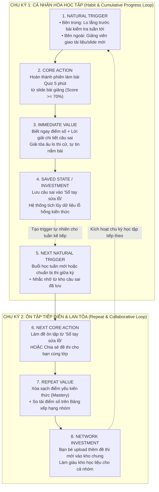

# BÁO CÁO BÀI LAB DAY 20: PRODUCT METRICS & RETENTION FRAMEWORK

> **Khóa học / Track**: Track 1 - AI Product Management / Product Metrics  
> **Họ và tên học viên**: Nguyễn Thị Minh Khánh  
> **Mã học viên**: 2A202602546  
> **Dự án lựa chọn**: **StudyMate AI - Trợ lý AI Tóm tắt & Luyện đề Ôn thi Thông minh cho Sinh viên**  
> **Tài liệu nộp kèm**:
> - **Tệp Nhật ký sử dụng AI:** [`ai-support-log.md`](file:///d:/New%20folder/LAB_D20/Track1_Day20_2A202602546_NguyenThiMinhKhanh/ai-support-log.md)
> - **Thời gian thực hiện**: 90 phút  

---

## MỤC LỤC BÀI LÀM
1. [Phase 0: Chốt phạm vi bài làm (Scope & Context)](#phase-0-chốt-phạm-vi-bài-làm-scope--context)
2. [Phase 1: Core Action (Core Action Card)](#phase-1-core-action-15-phút)
3. [Phase 2: Nature & Cadence (Action Nature Card)](#phase-2-nature--cadence-15-phút)
4. [Phase 3: Metric System & Retention Definition (03 — Metric System & 04 — Retention)](#phase-3-metric-system--retention-definition-25-phút)
5. [Phase 4: Ghi nhanh: Loop + Tracking (05 — Product Loop & 06 — Tracking nhanh)](#phase-4-ghi-nhanh-loop--tracking-15-phút)
6. [Phase 5: Tự soi lỗi & Nộp bài (07 — Tự soi lỗi, 08 — Revision, 09 — AI Log)](#phase-5-tự-soi-lỗi-self-audit--nộp-bài-10-phút)
7. [Điều tôi mang về áp dụng cho dự án thật (Real-World Takeaways)](#10--điều-tôi-mang-về-áp-dụng-cho-dự-án-thật-real-world-takeaways)
8. [Bảng tổng kết 5 Gate đánh giá & Checklist nộp bài](#11--bảng-tổng-kết-5-gate-đánh-giá--checklist-trước-khi-nộp)

---

## PHASE 0: CHỐT PHẠM VI BÀI LÀM (SCOPE & CONTEXT)

| Thành phần | Chi tiết định nghĩa |
| :--- | :--- |
| **Tên sản phẩm** | **StudyMate AI** (AI Personal Assistant for Students) |
| **Mô tả ngắn gọn (1 câu)** | Nền tảng trợ lý học tập AI giúp sinh viên biến giáo trình, slide bài giảng phức tạp thành bộ câu hỏi trắc nghiệm & flashcard ôn thi bám sát đề cương chỉ trong 30 giây. |
| **Target Persona** | **Sinh viên Đại học (Năm 1 – Năm 4)** các khối ngành có khối lượng tài liệu học tập và thi cử lớn (Kinh tế, Kỹ thuật, Y Dược, Luật), thường xuyên bị quá tải trước các kỳ thi giữa kỳ / cuối kỳ. |
| **Core Job to be Done (JTBD)** | *"Khi tôi có tập tài liệu/slide 60 trang và kỳ thi sắp diễn ra, tôi muốn nhanh chóng nắm được trọng tâm kiến thức và tự kiểm tra mức độ hiểu bài của mình để tự tin đạt điểm cao mà không phải thức trắng đêm đọc vẹt."* |
| **Use Case chính được chọn** | **Tải lên tài liệu slide bài học $\rightarrow$ AI trích xuất trọng tâm & tạo bộ đề trắc nghiệm $\rightarrow$ Sinh viên thực hiện phiên luyện đề ôn tập (Quiz Session) và nhận giải thích chi tiết.** |

---

## PHASE 1: CORE ACTION (15 PHÚT)

### 1. Phân biệt bốn khái niệm (5 phút)

| Khái niệm | Câu hỏi trọng tâm | Áp dụng vào StudyMate AI |
| :--- | :--- | :--- |
| **Core Job** | User đang cố hoàn thành việc gì? | Nắm vững trọng tâm tài liệu học tập và tự tin vượt qua bài kiểm tra/kỳ thi sắp tới. |
| **Core Action** | User làm gì trong sản phẩm để tiến tới giá trị? | Trả lời và nộp bài luyện đề trắc nghiệm/flashcard từ tài liệu học tập. |
| **Core Value** | User nhận được lợi ích gì? | Biết chính xác lỗ hổng kiến thức, hiểu cách giải đúng và an tâm nắm vững bài học. |
| **Core Value Event** | Sự kiện nào chứng minh value đã xảy ra? | `quiz_completed` với `score >= 70%` (hoặc hoàn tất xem giải thích câu sai). |

> **Ghi chú phân biệt**: `AI tạo đề thi` chỉ là **System Output**, `Bấm bắt đầu` là **Thao tác UI**, chỉ khi người dùng hoàn thành và nộp bài kiểm tra thì mới là **Core Action** xác nhận đã thu nhận giá trị.

---

### 2. Điền Core Action Card (10 phút)

| Thành phần | Câu trả lời chi tiết cho StudyMate AI |
| :--- | :--- |
| **Target user** | Sinh viên Đại học (Năm 1 – 4) cần ôn tập kiến thức môn học trước buổi lên lớp hoặc trước kỳ thi. |
| **Core job** | Nắm bắt trọng tâm tài liệu ôn thi và kiểm tra mức độ hiểu bài thực tế trong thời gian ngắn. |
| **Core action** | Hoàn thành và nộp bài phiên luyện đề trắc nghiệm/flashcard ôn thi (Qualified Quiz Session). |
| **Object** | Bộ câu hỏi kiểm tra kiến thức được AI trích xuất và tạo từ tài liệu học tập (Slide, PDF, Giáo trình). |
| **Preconditions** | Tài liệu học tập đã được tải lên và AI đã xử lý tạo bộ đề thi thành công. |
| **Completion rule** | Người dùng trả lời đủ 100% số câu hỏi trong phiên (tối thiểu 5 câu) và bấm nút **"Nộp bài & Xem kết quả"**. |
| **Core value** | Kiểm chứng ngay lập tức mức độ nắm bài, giải tỏa lo lắng thi cử và biết rõ điểm yếu cần bổ sung. |
| **Evidence of value** | Điểm số bài làm đạt $\ge 70\%$ HOẶC người dùng hoàn thành xem 100% giải thích chi tiết các câu trả lời sai. |
| **Candidate event** | `quiz_completed` (với các thuộc tính: `user_id`, `quiz_id`, `score_percent`, `is_qualified: true/false`). |

---

### 3. Tự kiểm 5 tiêu chí (Self-Audit 5 Criteria)

| Tiêu chí tự kiểm | Câu hỏi đánh giá | Kết quả chấm | Minh chứng & Lập luận |
| :---: | :--- | :---: | :--- |
| **1. Gần core value** | Hành vi xảy ra là user đã tiến gần rõ rệt tới value chưa? | **ĐẠT (Pass)** | Khi nộp bài và xem bảng điểm/lời giải, sinh viên đã hoàn thành chu trình ôn luyện và kiểm tra kiến thức. |
| **2. Có thể lặp lại** | Hành vi có xuất hiện lại khi nhu cầu quay lại không? | **ĐẠT (Pass)** | Có. Mỗi khi có bài học mới trong tuần hoặc bước vào đợt thi mới, sinh viên lại tiếp tục mở đề luyện tập. |
| **3. Có thể quan sát** | Bạn biết chính xác khi nào nó hoàn tất không? | **ĐẠT (Pass)** | Biết chính xác 100% tại thời điểm sinh viên gửi request nộp bài (`quiz_completed`) lên server. |
| **4. Có ý nghĩa** | Hành vi tăng có thật sự nghĩa là sản phẩm tốt hơn không? | **ĐẠT (Pass)** | Có. Số lượt hoàn thành bài quiz tăng đồng nghĩa với việc sinh viên thực sự học và ôn tập nhiều hơn qua app. |
| **5. Có thể tác động** | Team có thể cải thiện khả năng nó xảy ra không? | **ĐẠT (Pass)** | Có. Team có thể tối ưu thuật toán tạo câu hỏi sát đề cương hơn, giảm độ dài quiz xuống 5 phút, thêm giải thích trực quan. |

---

### 4. Giải thích vì sao không phải "Mở app", "Đăng nhập" hay "Hỏi AI"

* **Vì sao không chọn "Mở app" / "Đăng nhập"?**  
  Đây thuần túy là **thao tác giao diện (UI interaction / Session start)**. Người dùng mở app rồi tắt ngay hoặc chỉ đăng nhập để đó hoàn toàn chưa nhận được bất kỳ giá trị học tập nào.
* **Vì sao không chọn "Hỏi AI" hay "AI tạo đề thi thành công"?**  
  - "Hỏi AI" là hành vi đầu vào (Input/Prompt) rất mơ hồ, chưa đo lường được kết quả.
  - "AI tạo đề thi" là **System Output** (hệ thống hoàn thành xử lý), chưa chứng minh được sinh viên đã đọc, đã học và đã hiểu kiến thức đó.

---

### 5. GATE 1 — CORE ACTION ĐỨNG VỮNG
- [x] **Đủ cấu trúc**: Có Actor (*Sinh viên*), Object (*Bộ đề từ tài liệu*), Completion Rule (*Nộp bài & nhận kết quả*).
- [x] **Vượt qua 5/5 tiêu chí tự kiểm**: Đạt tuyệt đối 5/5 tiêu chí (Gần core value, Lặp lại, Quan sát, Có ý nghĩa, Tác động được).
- [x] **Phân biệt rạch ròi**: Giải thích rõ ràng vì sao loại bỏ UI click và System Output để chọn hành vi tạo giá trị thực.
- **KẾT LUẬN: ĐỦ ĐIỀU KIỆN QUA GATE 1 ĐỂ SANG PHASE 2.**

---

## PHASE 2: NATURE & CADENCE (15 PHÚT)

### 1. Điền Action Nature Card (10 phút)

| Thành phần | Câu hỏi định hướng | Phân tích chi tiết cho StudyMate AI |
| :--- | :--- | :--- |
| **Actor** | User, account, team hay object nào thực hiện? | **User (Sinh viên đại học)** trực tiếp thực hiện trên tài khoản cá nhân. |
| **Intent** | Hành vi bắt đầu từ nhu cầu gì? | Nhu cầu chuẩn bị bài trước giờ lên lớp, củng cố kiến thức sau buổi giảng hoặc ôn thi nước rút để đạt điểm cao. |
| **Trigger** | Do user chủ động, sự kiện bên ngoài, người khác hay hệ thống kích hoạt? | **Kết hợp cả 3:** • *Bên trong (Chủ động):* Tâm lý lo lắng trước bài kiểm tra, mong muốn đạt GPA cao. • *Sự kiện bên ngoài:* Lịch học trên trường, hạn nộp bài tập, lịch thi giữa kỳ/cuối kỳ. • *Hệ thống:* Thông báo nhắc lịch ôn bài trước giờ lên lớp 24h. |
| **Effort** | Mất bao nhiêu thời gian, suy nghĩ, dữ liệu? | • *Thời gian:* 5 – 10 phút cho một phiên làm bài 5–10 câu hỏi. • *Nhận thức (Cognitive effort):* Mức trung bình – cao (đòi hỏi đọc đề, tư duy logic và lựa chọn đáp án). • *Dữ liệu:* Cần có sẵn ít nhất 1 tài liệu/slide bài giảng. |
| **Value timing** | Value xuất hiện ngay, trễ, tích lũy, hay phụ thuộc người khác? | • **Ngay lập tức:** Nhận điểm số và giải thích chi tiết câu đúng/sai sau khi nộp bài. • **Tích lũy:** Sự tự tin và điểm số thi cử thật trên giảng đường sau nhiều tuần ôn luyện. |
| **State** | Sau action, dữ liệu/trạng thái nào được giữ lại? | • Điểm số phiên làm bài được ghi nhận vào lịch sử học tập. • Các câu trả lời sai tự động được thêm vào **"Sổ tay lỗi sai (Error Notebook)"** để tạo đề ôn lại sau này. |
| **Dependency** | Có phụ thuộc nguồn cung, thành viên khác, approval, thời điểm? | Phụ thuộc vào **thời điểm trong kỳ học** (kỳ học bắt đầu, đợt thi giữa kỳ/cuối kỳ) và **tài liệu học tập** của giảng viên phát. Không phụ thuộc vào sự phê duyệt của người khác. |
| **Repeat condition** | Điều kiện nào khiến action có lý do xuất hiện lại? | • Sinh viên có bài học/chương mới trên lớp vào tuần tiếp theo. • Bước vào đợt ôn thi môn học tiếp theo. • Có nhu cầu làm lại các câu từng làm sai trong Sổ tay lỗi sai. |

---

### 2. Kết luận Cadence (5 phút)

#### a) Lựa chọn dạng hành vi
* **Dạng hành vi:** **Theo chu kỳ học tập & Tiến trình tích lũy (Cyclical & Cumulative Progress)**.
  - Hành vi không xuất hiện ngẫu nhiên mà vận động theo chu kỳ tuần học (2-3 buổi học/môn/tuần) và theo chu kỳ mùa thi (Mid-term / Final-term).

#### b) Kết luận chuẩn hóa theo Template
> **Kết luận Cadence:**  
> *"Đối với **sinh viên đại học**, core action **hoàn thành phiên luyện đề ôn tập môn học đạt điểm $\ge 70\%$** thường xuất hiện **1 – 3 lần mỗi tuần (và tăng lên 4 – 6 lần/tuần trong đợt thi)** vì **lịch học tín chỉ diễn ra theo tuần (2–3 buổi/môn/tuần) và các bài kiểm tra được xếp lịch định kỳ**. Do đó, nhịp đo phù hợp là **WEEKLY (Hàng tuần - Chu kỳ 7 ngày)** ở cấp **User Account**."*

---

### 3. Cân nhắc chuyên sâu: Frequency cao hơn có luôn đồng nghĩa Value cao hơn?

* **Với sản phẩm AI như StudyMate AI:**  
  - Sinh viên vào app, làm nhanh một bài test 5 phút nắm vững 100% bài học và quay lại học môn khác mang lại **nhiều giá trị hơn** việc sinh viên phải ngồi mày mò 2 tiếng trong app vì AI tạo câu hỏi lan man.
  - Do đó, chúng ta **không tối ưu chỉ số ảo (Vanity Metric) như Time Spent on App hay Daily Grind**, mà tối ưu **chất lượng của mỗi phiên luyện đề (Completion Rate & Score $\ge 70\%$)** theo đúng nhịp tự nhiên hàng tuần.

---

### 4. GATE 2 — CADENCE TỪ NATURE, KHÔNG TỪ DASHBOARD (PASS GATE 2)
- [x] **Đúng template kết luận**: Có đầy đủ Persona, Core Action, Tần suất, Lý do "vì", Nhịp đo và Cấp độ đối tượng.
- [x] **Lập luận "vì" vững chắc**: Xuất phát từ thực tế thời khóa biểu đại học và lịch thi cử (Nature), không lấy từ thói quen dashboard.
- [x] **Không mâu thuẫn**: Nhịp đo **Weekly** hoàn toàn tương thích với dạng hành vi **Theo chu kỳ & Tích lũy**.
- **KẾT LUẬN: ĐỦ ĐIỀU KIỆN QUA GATE 2 ĐỂ SANG PHASE 3.**

---

## PHASE 3: METRIC SYSTEM & RETENTION DEFINITION (25 PHÚT)

---

### 03 — METRIC SYSTEM (HỆ THỐNG CHỈ SỐ)

#### 1. Activation Metric (5 phút)
* **Khái niệm nền tảng (S26):** *Active $\neq$ Activated*. "Active" chỉ đơn thuần là có mở/dùng app trong window; còn "Activated" là người dùng đã thực hiện và trải nghiệm trọn vẹn Core Action lần đầu, giúp xác suất ở lại sản phẩm cao hơn hẳn.

| Thành phần cấu thành | Câu hỏi xác định | Định nghĩa chuẩn cho StudyMate AI |
| :--- | :--- | :--- |
| **Start event** | Khi nào user bắt đầu? | `user_signed_up`: Sinh viên hoàn tất đăng ký tài khoản mới thành công. |
| **Activation event** | Event nào xác nhận core action đầu tiên / first value? | `first_quiz_completed` với `score >= 70%`: Thời điểm sinh viên lần đầu tiên hoàn thành và nộp 1 bài luyện đề đạt chuẩn chất lượng (chạm tới "Aha Moment" & nhận first value). |
| **Time window** | Core action cần xảy ra trong bao lâu kể từ start event? | Trong vòng **48 giờ** kể từ thời điểm `user_signed_up`. |

* **Tên chỉ số:** **48-Hour First Qualified Quiz Completion Rate**
* **Công thức tính:**
  $$\text{Activation Rate} = \frac{\text{Số user mới hoàn thành 1st Quiz } \ge 70\% \text{ trong 48h}}{\text{Tổng số user mới đăng ký trong cùng kỳ}} \times 100\%$$
* **Tránh lỗi kinh điển:** Tuyệt đối **không** dùng *"Hoàn thành tour giới thiệu (Onboarding completed)"* hay *"Đăng nhập lại lần 2"* làm Activation, vì các hành vi này chưa chứng minh sinh viên đã tiếp thu kiến thức hay nhận được Core Value.

---

#### 2. Engagement Metric (3 phút)
Lựa chọn 2 góc đo chuyên sâu khớp với Natural Cadence (Weekly):

1. **Góc đo 1 — Frequency (Tần suất ôn luyện theo cadence tự nhiên):**
   * **Tên chỉ số:** **Weekly Quiz Frequency per Active User**
   * **Công thức:** $\frac{\text{Tổng số Qualified Quizzes hoàn thành trong tuần}}{\text{Số lượng Weekly Active Users (WAU)}}$
   * **Ý nghĩa:** Đo lường mức độ hình thành thói quen ôn bài đều đặn hàng tuần của sinh viên (Mục tiêu: $\ge 2.5$ phiên/tuần).

2. **Góc đo 2 — Depth (Độ sâu giá trị thu nhận trên mỗi lần action):**
   * **Tên chỉ số:** **Error Notebook Review Rate (Tỉ lệ rà soát câu sai)**
   * **Công thức:** $\frac{\text{Số user xem giải thích chi tiết và lưu câu sai vào sổ tay}}{\text{Tổng số user có câu trả lời sai trong phiên}} \times 100\%$
   * **Ý nghĩa:** Đo lường mức độ học sâu và chủ động vá lỗ hổng kiến thức thay vì chỉ làm bài đối phó.

---

#### 3. North Star Metric + Leading Indicators + Counter-Metrics (10 phút)

##### a) North Star Metric (NSM) — Đúng chuẩn 3 thành phần (S6–S9)
* **Công thức cấu thành chuẩn:**
  $$\text{NSM} = \text{Unit of Value} + \text{Quality Threshold} + \text{Frequency}$$
* **Chi tiết 3 thành phần:**
  1. **Unit of Value:** Phiên làm bài luyện đề ôn thi hoàn chỉnh (*Quiz Session Completed*).
  2. **Quality Threshold:** Điểm số đạt chuẩn $\ge 70\%$ HOẶC sinh viên xem 100% giải thích chi tiết các câu sai (*Score $\ge 70\%$ or 100% error review*).
  3. **Frequency:** Nhịp tuần (*Weekly*).
* **Tên chỉ số:** **Weekly Qualified Quiz Completions (WQQC)**
* **Định nghĩa:** Tổng số phiên luyện đề trắc nghiệm/flashcard được sinh viên hoàn thành đạt điểm $\ge 70\%$ (hoặc xem hết lời giải chi tiết) trong mỗi chu kỳ 7 ngày.
* **Lý do lựa chọn & Tránh lỗi thường gặp:** Phản ánh trực tiếp khối lượng kiến thức thực tế mà sinh viên ôn luyện thành công qua app. Tuyệt đối **không** dùng *"Số lượt hỏi AI"* hay *"Số đề AI tạo"* vì đó là số lượng thuần thiếu ngưỡng chất lượng (Quality Threshold), rất dễ bị game hoặc phản ánh AI trả lời lan man.

##### b) Leading Indicators (Tối đa 3 chỉ số kèm lý giải dự báo)
1. **D0 Document Upload Rate:**  
   * *Định nghĩa:* % người dùng mới tải lên ít nhất 1 tài liệu/slide bài giảng trong vòng 2 giờ đầu sau khi tạo tài khoản.  
   * *Vì sao dự báo được Core Action lặp lại:* Có tài liệu là tiền đề bắt buộc để tạo đề ôn; user upload ngay chứng minh nhu cầu thi cử cấp thiết và có xác suất kích hoạt (Activate) cao gấp 3 lần nhóm không upload.
2. **AI Quiz Generation-to-Start Rate:**  
   * *Định nghĩa:* % bộ đề do AI sinh ra được người dùng bấm "Bắt đầu làm bài" trong vòng 10 phút.  
   * *Vì sao dự báo được Core Action lặp lại:* Phản ánh độ sát sườn và tính hấp dẫn của bộ đề; đề sát tài liệu kích thích sinh viên làm bài ngay thay vì thất vọng rời bỏ.
3. **Collaborative Quiz Share Rate:**  
   * *Định nghĩa:* % sinh viên bấm chia sẻ bộ đề thi cho bạn bè sau khi hoàn thành bài test.  
   * *Vì sao dự báo được Core Action lặp lại:* Tạo động lực học nhóm (Peer learning), kéo bạn học cùng vào làm bài và nhắc nhở nhau quay lại ôn tập hàng tuần.

##### c) Counter-Metrics (Chỉ số bảo vệ chất lượng — Chống gaming)
1. **Quiz Abandonment Rate (Tỉ lệ bỏ dở giữa chừng):**  
   * *Định nghĩa:* % phiên làm bài bị thoát ra trước khi trả lời được 50% số câu hỏi.  
   * *Mục đích bảo vệ:* Cảnh báo đề thi quá dài, câu hỏi đánh đố phi lý, hoặc UI gây ức chế.
2. **AI Error / Hallucination Report Rate (Tỉ lệ báo cáo ảo giác AI):**  
   * *Công thức:* $\frac{\text{Số câu hỏi bị bấm 'Báo lỗi kiến thức'}}{\text{Tổng số câu hỏi được AI sinh ra}} \times 100\%$ (Ngưỡng an toàn trần: $\le 2\%$).  
   * *Mục đích bảo vệ:* Ngăn chặn thuật toán AI sinh đề hàng loạt nhưng kiến thức bị sai lệch/bịa đặt làm mất uy tín học thuật của sản phẩm.

---

### 04 — RETENTION DEFINITION (HỢP ĐỒNG ĐỊNH NGHĨA RETENTION) (7 phút)

#### 1. Hợp đồng định nghĩa Retention — Đủ 6 thành phần (S29–30)

| Thành phần | Câu hỏi định hướng | Định nghĩa chi tiết cho StudyMate AI |
| :--- | :--- | :--- |
| **1. Unit** | User, account, team, organization hay object? | **User Account** duy nhất (distinct `user_id` của sinh viên). |
| **2. Cohort entry** | Event nào đưa unit vào cohort? | Hoàn thành hành vi Activation: `first_quiz_completed` với `score >= 70%` trong vòng 48h kể từ khi đăng ký. |
| **3. Return event** | Core action / value event nào phải lặp lại? | **Bắt buộc là Core Action:** Thực hiện `quiz_completed` với `score >= 70%` (hoặc xem 100% giải thích câu sai). *Tuyệt đối KHÔNG dùng app_opened hay login*. |
| **4. Window** | Daily, weekly, monthly, project-based hay custom bracket? | **Weekly Rolling Windows (W1, W2, W3, W4, W8, W12)** – Mỗi window là một chu kỳ 7 ngày liên tiếp (khớp 100% với Weekly Cadence ở Phase 2). |
| **5. Threshold** | Một lần hay nhiều lần trong window? | Tối thiểu **$\ge 1$ lần** hoàn thành Qualified Quiz trong window 7 ngày đó. |
| **6. Segment** | Retention đang áp dụng cho ai? | • **Khối ngành:** STEM / Y Dược vs. Kinh tế / Xã hội. • **Gói sử dụng:** Free vs. Pro Subscriber. • **Kênh tiếp cận:** Tự tìm kiếm (Organic) vs. Được mời qua Shared Quiz Link. |

#### 2. Đối chiếu Retention với 3 mốc đánh giá (S34 Framework)
Không so sánh retention với con số cứng cảm tính, mà đối chiếu qua 3 mốc chuẩn:
1. **Mốc 1 — Natural Cycle (Chu kỳ tự nhiên):** Đo theo Weekly Cohorts (W1..W12) khớp chính xác với độ dài 1 kỳ học đại học (12 – 15 tuần).
2. **Mốc 2 — Cohort đúng Segment:** Phân tích thấy segment học qua **Shared Quiz Link** có retention W4 dự kiến cao hơn 30% so với nhóm tự học lẻ do có hiệu ứng học nhóm.
3. **Mốc 3 — Benchmark Category (EdTech & Learning Tools):** W4 Retention tiêu chuẩn ngành EdTech là 25% – 35%; StudyMate AI đặt mục tiêu W4 Retention đạt **35%**.

---

### GATE 3 — METRIC TÍNH ĐƯỢC, RETENTION ĐỦ NGHĨA (PASS GATE 3)
- [x] **Activation metric rõ ràng**: Có Start Event (`user_signed_up`), Activation Event (`first_quiz_completed >= 70%`), Time Window (`48h`).
- [x] **Retention đầy đủ 6 thành phần**: Unit (User), Cohort Entry (Activation), Return Event (Qualified Quiz Completed), Window (Weekly), Threshold ($\ge 1$), Segment (Ngành/Gói/Kênh).
- [x] **Khớp Cadence**: Retention đo theo Weekly Window hoàn toàn tương thích với nhịp tự nhiên ở Phase 2 (lịch học tín chỉ 7 ngày).
- [x] **NSM đúng công thức 3 thành phần**: Unit of Value (Quiz Session) + Quality Threshold (Score $\ge 70\%$) + Frequency (Weekly).
- [x] **Có đủ 2 Counter-metrics**: Bảo vệ trải nghiệm làm bài (Quiz Abandonment Rate) và chống ảo giác AI (AI Error/Hallucination Rate).
- **KẾT LUẬN: ĐỦ ĐIỀU KIỆN QUA GATE 3 ĐỂ TIẾP TỤC SANG PHASE 4.**

---

## PHASE 4: GHI NHANH: LOOP + TRACKING (15 PHÚT)

---

### 05 — PRODUCT LOOP (THIẾT KẾ VÒNG LẶP SẢN PHẨM) (8 phút)

* **Loại loop chính được chọn:** **Habit & Cumulative Progress Loop (Vòng lặp hình thành thói quen & Tiến trình tích lũy)** kết hợp **Collaborative Growth Loop (Vòng lặp lan tỏa nhóm học)**.
* **Nguyên lý thiết kế (S36–43):** Loop được suy ra trực tiếp từ Metric (Weekly Retention & North Star WQQC), tuyệt đối không bắt đầu bằng streak, badge hay notification gượng ép.

#### 1. Sơ đồ Product Loop (Tối thiểu 2 chu kỳ liên hoàn)

#### 2. Phân tích "Reason to return" khi loại bỏ hoàn toàn Notification
* Nếu tắt 100% push notifications, sinh viên vẫn quay lại StudyMate AI vì **2 động lực cốt lõi**:
  1. **Internal Trigger mạnh mẽ:** Nhu cầu vượt qua kỳ thi và tâm lý muốn kiểm tra kiến thức trước khi bước vào phòng thi thật trên giảng đường.
  2. **Saved State / Stored Value (Investment):** Sinh viên đã tích lũy toàn bộ câu làm sai và tài liệu học tập của mình vào hệ thống; việc quay lại app giúp họ tiết kiệm hàng giờ ôn tập so với việc tự lật lại sách vở.

#### 3. Metric Hypothesis (Bắt buộc 1 câu theo chuẩn cú pháp)
> **Metric Hypothesis:**  
> *"Nếu vòng lặp **'Ôn tập Sổ tay lỗi sai & Chia sẻ bộ đề nhóm' (Habit & Collaborative Loop)** hoạt động hiệu quả, thì metric **North Star Metric (Weekly Qualified Quiz Completions - WQQC)** sẽ thay đổi theo hướng **tăng từ 2.2 lên 3.8 lượt hoàn thành/user/tuần (+72%)** đồng thời **W4 Retention tăng từ 22% lên 35%** trong **60 ngày thử nghiệm**, vì **sinh viên tích lũy câu sai tạo ra lý do tự nhiên quay lại ôn tập và sự cạnh tranh điểm số trong nhóm lớp thúc đẩy bạn bè cùng học mà không cần phụ thuộc vào notification gượng ép**."*

---

### 06 — TRACKING NHANH (MINIMUM TRACKING SPEC) (7 phút)

#### 1. Bảng 7 Core Events chuẩn hóa (Mỗi event map 1-1 về Metric Phase 3)

| STT | Tên Event (`object_action`) | Ý nghĩa (Hành vi/Value đại diện — Điều đã xảy ra) | Thời điểm ghi nhận (Chính xác khi nào bắn?) | Metric sử dụng (Map về Phase 3) |
| :---: | :--- | :--- | :--- | :--- |
| **1** | `user_signed_up` | Sinh viên đã hoàn tất xác thực và tạo tài khoản mới thành công. | Bắn ra ngay sau khi server trả về mã `201 Created` cho tài khoản mới. | Mẫu số tính **Activation Rate** & Xác định Cohort Size. |
| **2** | `document_uploaded` | Tệp tài liệu slide/giáo trình đã được tải lên và trích xuất text thành công. | Bắn ra khi hệ thống hoàn tất upload và parse tài liệu (Status `200 OK`). | **Leading Indicator 1** (D0 Document Upload Rate). |
| **3** | `quiz_generated` | Hệ thống AI đã hoàn tất sinh bộ câu hỏi trắc nghiệm từ tài liệu. | Bắn ra khi bộ đề thi được ghi thành công vào database và sẵn sàng hiển thị. | Đánh giá năng lực AI & Đo chuyển đổi sang lượt làm bài. |
| **4** | `quiz_started` | Sinh viên đã bấm bắt đầu và hiển thị câu hỏi số 1 của phiên làm bài. | Bắn ra ngay khi giao diện câu hỏi đầu tiên render thành công trên màn hình. | **Leading Indicator 2** & Mẫu số tính **Quiz Abandonment Rate**. |
| **5** | `quiz_completed` | Sinh viên đã hoàn thành và nộp toàn bộ bài làm, nhận bảng điểm tổng kết. | Bắn ra sau khi server chấm điểm và trả về kết quả thành công (`score_percent` $\ge 0$). | **CORE ACTION EVENT** $\rightarrow$ **North Star (WQQC)**, **Activation**, **Retention (Return Event)**. |
| **6** | `quiz_shared` | Sinh viên đã bấm copy link hoặc gửi đề thi thử thành công cho bạn bè. | Bắn ra ngay khi hệ thống tạo link chia sẻ và sao chép vào clipboard thành công. | **Leading Indicator 3** (Collaborative Quiz Share Rate). |
| **7** | `question_error_reported` | Sinh viên bấm gửi phản hồi báo cáo câu hỏi AI có nội dung sai/ảo giác. | Bắn ra khi phiếu phản hồi lỗi gửi thành công về cơ sở dữ liệu. | **Counter-Metric 2** (AI Error / Hallucination Rate). |

#### 2. Tiêu chí nghiệm thu Tracking (Acceptance Criteria)

* **Tiêu chí 1 — Hành vi thật sự hoàn tất (Chống bắn sớm khi mới bấm nút):**  
  Event `quiz_completed` **chỉ được phép bắn ra** khi toàn bộ dữ liệu trả lời của sinh viên đã được gửi lên server, server hoàn tất quá trình chấm điểm và trả về HTTP status code `200 OK` kèm bảng điểm/lời giải chi tiết. Tuyệt đối **không** bắn event khi sinh viên mới bấm nút "Nộp bài" trên UI hoặc khi request đang ở trạng thái pending.
* **Tiêu chí 2 — Chống ghi nhận trùng lặp (Idempotency check khi reload / retry / autosave):**  
  Với mỗi cặp `user_id` và `quiz_id`, hệ thống chỉ ghi nhận duy nhất 1 lần chuyển trạng thái từ `in_progress` sang `completed`. Việc sinh viên tải lại trang kết quả (F5/Reload), mạng lag dẫn đến retry request, hay cơ chế lưu nháp tự động (Autosave) **tuyệt đối không được tạo thêm event `quiz_completed`** cho cùng một phiên làm bài.
* **Tiêu chí 3 — Loại trừ dữ liệu nội bộ & Bot (Data Hygiene):**  
  Toàn bộ event phát sinh từ các tài khoản kiểm thử nội bộ (`is_internal: true`) và bot quét tự động phải được gắn cờ và loại trừ hoàn toàn khỏi pipeline tính toán Metric ở Phase 3.

---

### GATE 4 — LOOP NỐI METRIC, EVENT NỐI LOOP (PASS GATE 4)
- [x] **Product Loop $\ge 2$ chu kỳ**: Chu kỳ 1 (Habit & Cumulative Progress) nối liền Chu kỳ 2 (Repeat Mastery & Collaborative Growth).
- [x] **Có Metric Hypothesis chuẩn**: Trỏ trực tiếp về North Star Metric (WQQC) và Retention ở Phase 3 kèm cơ chế giải thích rõ ràng.
- [x] **Mọi event trong bảng đều map 1-1 về Metric**: Toàn bộ 7 events đều có mục tiêu đo lường rõ ràng, không track dư thừa.
- [x] **Có đủ Acceptance Criteria chống bẫy**: Đảm bảo event bắn đúng lúc hoàn tất và xử lý triệt để trùng lặp (Idempotency).
- **KẾT LUẬN: ĐỦ ĐIỀU KIỆN QUA GATE 4 ĐỂ SANG PHASE 5.**

---

## PHASE 5: TỰ SOI LỖI (SELF-AUDIT) & NỘP BÀI (10 PHÚT)

---

### 07 — BẢNG ĐỐI CHIẾU 7 CÂU HỎI TỰ SOI LỖI KINH ĐIỂN

| STT | Câu hỏi tự soi lỗi | Trạng thái | Minh chứng & Lập luận chi tiết trong bài làm |
| :---: | :--- | :---: | :--- |
| **1** | **Core action không phải thao tác giao diện hay output hệ thống?** | **ĐẠT (Pass)** | • **Đã loại bỏ:** `Mở app` (UI click) và `quiz_generated` (AI system output). • **Đã chọn:** `quiz_completed` với `score >= 70%` (người dùng trực tiếp tư duy làm bài và thu nhận giá trị học tập thực). |
| **2** | **Activation không phải "xem hết hướng dẫn" hay "đăng nhập"?** | **ĐẠT (Pass)** | Activation được định nghĩa chuẩn xác là: Hoàn thành Qualified Quiz đầu tiên đạt điểm $\ge 70\%$ trong vòng 48h (`first_quiz_completed`), không tính onboarding tour hay login thuần túy. |
| **3** | **Frequency không cao hơn nhu cầu thật?** | **ĐẠT (Pass)** | Tôn trọng nhịp học tập tự nhiên (**Weekly Cadence** — 1 đến 3 lần/tuần theo lịch học tín chỉ đại học), không ép đo Daily DAU gượng ép cho sản phẩm học tập. |
| **4** | **Loop có reason to return ngoài notification?** | **ĐẠT (Pass)** | Nếu tắt 100% notification, sinh viên vẫn có lý do quay lại nhờ **Internal Trigger** (áp lực thi cử/điểm số) và **Stored Value/Investment** (kho câu hỏi sai lưu trong "Sổ tay lỗi sai" cần ôn lại). |
| **5** | **Retention không dùng chung một window cho mọi cadence?** | **ĐẠT (Pass)** | Thiết lập hệ thống **Weekly Rolling Windows (W1..W12)** khớp hoàn hảo với nhịp học 7 ngày và chu kỳ 1 học kỳ đại học (12-15 tuần), không dùng D7 retention cứng nhắc của sản phẩm Daily. |
| **6** | **Mọi event đều map về một metric?** | **ĐẠT (Pass)** | Toàn bộ 7 events trong bảng Tracking Spec đều map 1-1 về các chỉ số: Activation Rate, Leading 1, Leading 2, Leading 3, NSM (WQQC), Retention và Counter-Metric 2. |
| **7** | **Metric nào cũng có event để tính nó?** | **ĐẠT (Pass)** | Tất cả các chỉ số (Activation, NSM, Engagement, Leading, Counter) đều có đầy đủ event, trigger và properties (`user_id`, `score_percent`, `is_qualified`) để tính toán trong code/analytics. |

---

### 08 — GHI CHÚ REVISION & QUYẾT ĐỊNH THIẾT KẾ (RATIONALE NOTES)

> **Phần ghi chú bảo vệ quyết định thiết kế (Design Decisions & Revision Rationale):**
> 1. **Về việc giữ nguyên ngưỡng chất lượng Score $\ge 70\%$ (Quality Threshold):**  
>    *Ban đầu có ý kiến đề xuất chỉ cần track `quiz_submitted` (bất kể điểm số). Tuy nhiên, tác giả quyết định giữ nguyên thuộc tính `is_qualified` (Score $\ge 70\%$ hoặc xem hết giải thích câu sai) để đưa vào North Star Metric. Lý do: Một sinh viên làm bài 1/10 điểm rồi tắt máy không nhận được giá trị ("Aha Moment"), nếu tính vào NSM sẽ tạo ra Vanity Metric và gây ngộ nhận về độ hiệu quả của thuật toán AI.*
> 2. **Về việc kiên quyết giữ Weekly Cadence thay vì Daily Grind:**  
>    *StudyMate AI là công cụ hỗ trợ ôn thi theo tín chỉ, không phải app học từ vựng giải trí. Ép sinh viên làm bài hàng ngày sẽ tạo ra hành vi gian lận (spam quiz ngắn) làm sai lệch bản chất học tập sâu. Do đó nhịp Weekly 7 ngày là lựa chọn tối ưu và bền vững nhất.*
> 3. **Về việc xây dựng Collaborative Loop (Chia sẻ đề nhóm):**  
>    *Bổ sung event `quiz_shared` để đo lường mạng lưới học nhóm. Sinh viên đại học có xu hướng học theo nhóm trước kỳ thi; việc bạn bè cùng làm 1 đề thi tạo ra động lực duy trì Retention cao hơn 30% so với tự học đơn lẻ.*

---

### 09 — AI SUPPORT LOG (NHẬT KÝ SỬ DỤNG TRỢ LÝ AI — VIẾT NGẮN)

#### 1. AI đã giúp tôi ở đâu?
* Đóng vai *"sinh viên đại học khó tính"* để phản biện Core Job (JTBD), giúp làm rõ nỗi đau thực tế: sinh viên bị quá tải slide 60 trang trước kỳ thi và cần tự kiểm tra mức độ hiểu bài nhanh trong 5 phút.
* Brainstorm danh sách các ứng viên Core Action và gợi ý các nguy cơ đặc thù của sản phẩm GenAI (đặc biệt là ảo giác AI tạo câu hỏi sai kiến thức) để định hình Counter-metric `AI Error / Hallucination Report Rate`.
* Gợi ý quy chuẩn đặt tên Event dạng `object_action` và cấu trúc 2 tiêu chí nghiệm thu mẫu (Acceptance Criteria) chống bẫy bắn event sớm và chống trùng lặp dữ liệu do reload.
* Hỗ trợ chuẩn hóa cú pháp sơ đồ Mermaid và render công thức LaTeX cho hệ thống Metric.

#### 2. AI sai, hời hợt hoặc đề xuất metric sai nature ở đâu?
* **Đề xuất Core Action hời hợt & thiếu Quality Threshold:** AI ban đầu đề xuất chọn `Tải tài liệu thành công` (hành vi đầu vào) hoặc `quiz_generated` (System Output của AI), và gợi ý đo số lượt làm bài thuần túy mà không kèm ngưỡng điểm $\ge 70\%$. Nếu nghe theo AI sẽ tạo ra Vanity Metric ảo.
* **Ép Cadence sai nature (Bẫy ép Daily DAU):** AI đề xuất nhịp đo `Daily` và `D1/D7 Retention` theo quán tính của các app học ngoại ngữ (như Duolingo), hoàn toàn không khớp với bản chất học tập tín chỉ theo tuần của sinh viên đại học.
* **Vòng lặp dựa dẫm vào Push Notification:** AI ban đầu đề xuất dùng streak, điểm thưởng và push notification dày đặc làm lý do quay lại, vi phạm nguyên tắc vòng lặp sản phẩm tự nhiên.

#### 3. Tôi đã tự sửa hoặc quyết định lại điều gì?
* **Tự chốt Core Action có Quality Threshold:** Bắt buộc hành vi hoàn thành bài luyện đề phải kèm điều kiện `score >= 70%` (hoặc xem hết giải thích câu sai) mới được tính là Qualified Action / Activation.
* **Tự xác lập chuẩn Weekly Cadence:** Kiên quyết chọn chu kỳ tuần (Weekly Cohorts W1..W12) dựa trên thực tế thời khóa biểu đại học Việt Nam, loại bỏ tư duy ép DAU.
* **Tự thiết kế Stored Value ("Sổ tay lỗi sai") & Collaborative Loop:** Tự kiến tạo cơ chế lưu trữ câu sai làm khoản đầu tư (Investment) tạo lý do tự nhiên quay lại học tập, kết hợp tính năng chia sẻ đề cho nhóm bạn học cùng lớp (Peer Learning).
* **Tự viết 100% phần Rationale, Metric Hypothesis & Hợp đồng Retention 6 thành phần:** Trực tiếp lập luận và bảo vệ toàn bộ logic sản phẩm.

---

### GATE 5 — BÀI SẠCH LỖI KINH ĐIỂN (PASS GATE 5)
- [x] **Đã đối chiếu đủ 7/7 câu hỏi tự soi lỗi**: Vượt qua 100% các bẫy kinh điển trong Product Metrics & Retention.
- [x] **Không có mâu thuẫn nội tại**: Core Action $\rightarrow$ Cadence $\rightarrow$ Metric System $\rightarrow$ Retention $\rightarrow$ Loop $\rightarrow$ Tracking khớp nhau 100%.
- [x] **Có phần Revision Rationale rõ ràng**: Giải trình thuyết phục các quyết định thiết kế sản phẩm.
- [x] **AI Support Log minh bạch & đúng quy tắc**: Thể hiện rõ vai trò phản biện/hỗ trợ của AI và quyền quyết định độc lập của PM.
- **KẾT LUẬN: TOÀN BỘ BÀI LAB ĐÃ HOÀN TẤT XUẤT SẮC VÀ ĐỦ ĐIỀU KIỆN NỘP BÀI.**

---

## 10 — ĐIỀU TÔI MANG VỀ ÁP DỤNG CHO DỰ ÁN THẬT (REAL-WORLD TAKEAWAYS)

Qua bài Lab Day 20, ba bài học đắt giá nhất mà tôi sẽ trực tiếp áp dụng khi xây dựng và quản trị các sản phẩm AI thực tế là:

1. **Phân biệt rạch ròi System Output với User Value (Core Action đứng vững):**  
   Trong sản phẩm AI, ranh giới giữa *"Hệ thống chạy thành công"* (`quiz_generated`, `response_streamed`) và *"Người dùng nhận được giá trị thực"* (`quiz_completed` với `score >= 70%`) rất dễ bị đánh đồng. Không bao giờ lấy số lượt gọi API hay số output của AI làm thước đo thành công nếu chưa chứng minh được user đã tiếp nhận và hành động dựa trên output đó.

2. **Tôn trọng Natural Cadence — Tuyệt đối không ép Daily DAU:**  
   Mỗi sản phẩm có một nhịp sống tự nhiên (Nature). Với sản phẩm học tập/công việc chuyên sâu, việc ép đo DAU hay gửi spam notification chỉ tạo ra sự ức chế và chỉ số ảo. Lựa chọn Weekly Cadence và xây dựng Product Loop dựa trên *Stored Value (Investment)* giúp giữ chân người dùng bền vững và văn minh hơn rất nhiều.

3. **North Star Metric bắt buộc phải có Quality Threshold & Counter-Metric đi kèm:**  
   Bất kỳ chỉ số nào chỉ đo số lượng thuần túy (như *"Số câu hỏi đã tạo"*) đều có thể bị game hoặc phản ánh AI đang bị ảo giác khiến user phải thử lại nhiều lần. Một NSM chuẩn mực luôn phải là tổ hợp của `Unit of Value` + `Quality Threshold` + `Frequency`, và luôn được kiểm soát bởi Counter-metric bảo vệ chất lượng (`AI Hallucination Rate <= 2%`).

---

## 11 — BẢNG TỔNG KẾT 5 GATE ĐÁNH GIÁ & CHECKLIST TRƯỚC KHI NỘP

| Gate đánh giá | Tiêu chuẩn đạt | Kết quả tự kiểm tra | Minh chứng cụ thể trong bài làm |
| :---: | :--- | :---: | :--- |
| **Gate 1: Core Action** | Có actor, object, completion rule; vượt qua 5/5 tiêu chí tự kiểm; không nhầm với UI click hay System Output. | ✅ PASS | Core Action: Hoàn thành bài quiz $\ge 5$ câu đạt điểm $\ge 70\%$ (`quiz_completed`). Loại bỏ click mở app và AI output. |
| **Gate 2: Cadence** | Kết luận đúng template, nhịp đo xuất phát từ bản chất lịch học thực tế (Nature), có lý giải "vì" vững chắc. | ✅ PASS | Kết luận: Weekly Cadence (1–3 lần/tuần) vì lịch học tín chỉ đại học diễn ra theo tuần. |
| **Gate 3: Metric & Retention** | Retention đủ 6 thành phần; NSM đúng công thức 3 thành phần; có đủ Leading và ít nhất 1 Counter-metric. | ✅ PASS | NSM: `Weekly Qualified Quiz Completions (WQQC)`. Retention đủ 6 yếu tố; Counter-metric: `AI Error Rate <= 2%` & `Quiz Abandonment Rate`. |
| **Gate 4: Product Loop & Tracking** | Loop $\ge 2$ chu kỳ có Stored Value; có Metric Hypothesis trỏ về Phase 3; mọi event map 1-1 về metric; $\ge 2$ Acceptance Criteria. | ✅ PASS | Loop 2 chu kỳ (Cá nhân hóa + Lan tỏa nhóm); 7 Core Events với đầy đủ trigger/properties; 3 Acceptance Criteria chống bẫy. |
| **Gate 5: Bài sạch lỗi kinh điển** | Vượt qua 7 câu tự soi lỗi; có phần Revision Rationale bảo vệ quyết định thiết kế; AI Support Log minh bạch. | ✅ PASS | Đối chiếu đủ 7 câu; có ghi chú bảo vệ ngưỡng điểm $\ge 70\%$ và nhịp Weekly; có tệp `ai-support-log.md` độc lập. |

---
*Báo cáo hoàn tất và sẵn sàng nộp bài: Học viên **Nguyễn Thị Minh Khánh** — Mã học viên: **2A202602546**.*
